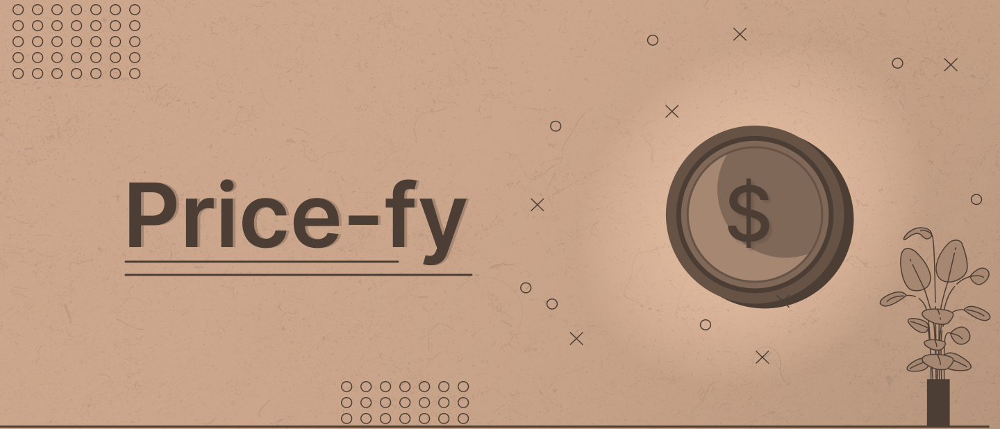

 
 

Price-fy 🪙 Concluído 

  <a href="#sobre">Sobre</a> • <a href="#layout">Layout</a> • <a href="#tecnologias">Tecnologias</a> •  <a href="#autor">Autor</a> • <a href="#licenca">Licença</a> 

 
<h3 id="sobre" style="border-bottom:3px solid #CCCEDB; padding-bottom: 15px">📌 Sobre</h3>

O "price-fy" é uma aplicação criada para adicionar, de maneira automática, título e preço em posts de produtos para o instagram. 
Ele tem por objetivo de simplificar e agilizar o processo de edição de imagens, que se mostra repetitivo e muitas vezes complexo para o público leigo   

 
<h3 id="layout" style="border-bottom:3px solid #CCCEDB; padding-bottom: 15px"> 🎨 Layout</h3>

Todo o layout/assets foram feitos inicialmente no figma  

 
<h3 id="tecnologias" style="border-bottom:3px solid #CCCEDB; padding-bottom: 15px"> 🛠️ Tecnologias</h3>

As seguintes ferramentas foram usadas na construção do projeto:

#### Backend
- [Flask](https://flask.palletsprojects.com/) 
-  [Pillow](https://pillow.readthedocs.io/) 
- [Pipenv](https://pipenv.pypa.io/) 

#### Frontend

- [Html5](https://developer.mozilla.org/pt-BR/docs/Web/HTML) 
-  [CSS3](https://developer.mozilla.org/pt-BR/docs/Web/CSS) 
- [JavaScript](https://developer.mozilla.org/pt-BR/docs/Web/javascript) 

#### Hospedagem

- [Vercel](https://vercel.com/) 
-  [Github](https://github.com/) 

#### Utilitários

- [Editor: VS Code](https://code.visualstudio.com/) 
- [Extensão: Thunder Client](https://www.thunderclient.com/) 
-  [Protótipo: Figma](https://www.figma.com/) 

 
<h3 id="autor" style="border-bottom:3px solid #CCCEDB; padding-bottom: 15px">🦸 Autor</h3>

<a href="https://www.instagram.com/vinirz11/" style="text-align: center; width: 100%;">Vinicius Reis - Instagram</a>

 
<h3 id="licenca" style="border-bottom:3px solid #CCCEDB; padding-bottom: 15px"> 📑 Licença</h3>

Este projeto esta sobe a licença  [MIT](https://github.com/VRZ0/vl-front/blob/main/LICENSE.md).

Feito com  ❤️  por Vinicius Reis 😎
